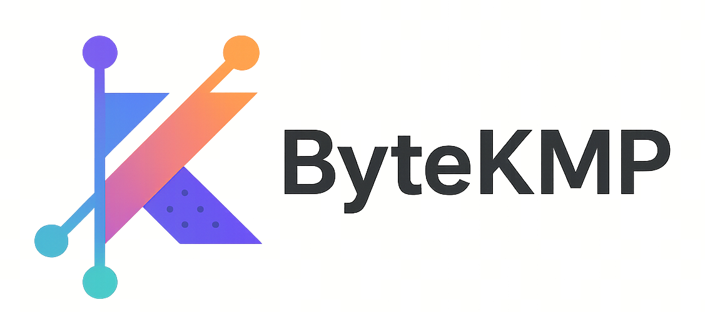

<p align="center">
    
</p>

[English](README.md) | 简体中文

ByteKMP 是基于 Kotlin Multiplatform(KMP) 与 Compose Multiplatform(CMP) 构建的跨平台开发框架，旨在保持各平台原生能力与用户体验的前提下，实现 Android、iOS、鸿蒙三端核心代码的高效复用，提升开发效率并降低维护成本。

# 工程结构

```
├── app
│   ├── androidApp      # Android 宿主工程
│   ├── iosApp          # iOS 宿主工程 (Swift/SwiftUI)
│   └── ohosApp         # HarmonyOS 宿主工程 (ArkTS)
├── build-logic         # 处理 iOS 与非 iOS 下的 Kotlin、Compose 版本差异
├── launcher            # Kotlin/Native 的顶层模块，为 iOS、鸿蒙生成统一 so
├── sample              # 示例代码
├── todo                # 示例代码
```

# 运行项目

## Android

1.  使用 **Android Studio** 打开项目根目录。
2.  等待 Gradle Sync 完成。
3.  在运行配置中选择 `app.androidApp`。
4.  连接 Android 设备或模拟器，点击运行。

## iOS
1.  确保已安装 Xcode26。
2.  在根目录执行 `./gradlew :launcher:generateDummyFramework`
3.  进入 `app/iosApp` 目录
4.  执行 `bash init_danceui.sh`
5.  执行 `bundle install` 和 `bundle exec pod install`
6.  双击打开 `iosApp.xcworkspace`
7.  等待索引和构建配置完成
8.  选择 iOS 模拟器或真机，点击运行 (Run)

## HarmonyOS
1. 在根目录执行 `./gradlew bundleDebugHar`
2. 安装 **DevEco Studio** 并配置好 SDK
3. 使用 DevEco Studio 打开 `app/ohosApp` 目录
4. **配置签名**: 打开 **File -> Project Structure -> Signing Configs**，勾选 "Automatically generate signature"
5. **同步工程**: 点击 **File -> Sync and Refresh Project**
6. 连接鸿蒙真机或启动模拟器，点击运行

# 加入我们
**我们是「抖音客户端架构」团队，以「打造极致的研发效能，助力业务高效发展」为使命，「成为行业卓越的架构师团队」为愿景 ，为抖音客户端高效、高质量交付保驾护航。欢迎对跨平台渲染、KMP 容器/运行时、性能与编译优化、包体与工程治理、AI Coding 感兴趣的同学加入我们，有意者可联系 wulinpeng@bytedance.com 。**

# License
本项目采用 [Apache-2.0 License](LICENSE.txt) 许可证开源
